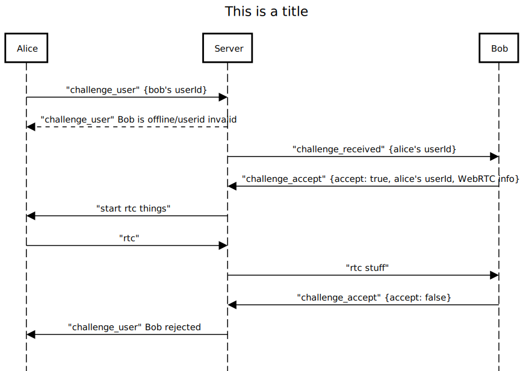

# TODO: Routes

## Leaderboard

- Get top players
- Get players similar rank
- Get your rank

## Gameplay

- Matchmaking random

## Friends 

- Delete friends

## User Stats

- Wins
- Losses

# Data

---

Clean User: This is what you'll get back on any request that returns a user

```json
{
  "userId": "String",
  "username": "String",
  "stats": {
    "wins": "Number",
    "losses": "Number",
    "Rank": "Number",
    "lastLogin": "Date"
  }
}
```

# Endpoints:

---

## socket.io

### signup

---

**Request format:**

```json
{
  "email": "String",
  "username": "String",
  "password": "String"
}
```
**Returns:**

```js
"success": "Boolean"
"userId": "String"
```
### login

---

**Request format:**

```json
{
  "username": "String",
  "password": "String"
}
```

**Returns:**

```js
"success": "Boolean"
"status": "String"
```
### sign_out

---

**Request format:**

**Returns**

**Returns:**

```js
"success": "Boolean"
```

False if user is not logged in/does not exist, true if they are logged in and has been successfully logged out.

### auth_status

---

**Request format:**

**Returns**:

```js
"success": "Boolean"
```

False if user is not logged in/does not exist, true if they are logged in.

### find_users

---

**requires auth**

Finds all users whose names start with string

**Request format:**

```json
"query": "String"
```

**Returns:**

```json
"success": "Boolean"
"user:: [User]
```

### add_friend

---

**requires auth**

Adds friend given userid.

**Request format:**

```json
"success": "Boolean"
"friendId": "String"
```

### get_friends

---

**requires auth**

Gets all friends

**Returns:**

```js
"success": "Boolean"
[User]
```

List of friends, with their usernames and userids

### challenge_user

---

**requires auth**

challenges user

**Request format:**

```json
"success": "Boolean"
"userId": "String"
```



### challenge_received

---

Server sends challenge to challenge

**Returns**
```json
userId: "String"
```

### challenge_accept

---

**requires auth**

**Request format:**

```json
"accept": "Boolean",
"rtc_offer": "Object",
"userId": "String"
```

### rtc_answer

---

**requires auth**

**Request format:**

```json
"id": "Boolean",
"rtc_answer": "Object",
```

### rtc_candidate

---

**requires auth**

**Request format:**

```json
"id": "Boolean",
"message": "Object",
```

### game_finished

---

**requires auth**

Logs stats after finished game. Intended for host to submit stats for both players.

**Request format:**

```json
"opponentId": "String"
"myStats": {
  "winner": "Boolean"
}
"opponentStats": {
  "winner": "Boolean"
}
```

**Returns:**

```json
"success": "Boolean"
"message": "Object"
```

### top_players

---

**requires auth**

Gets top 10 players by rank

**returns:**

```js
"success": "Boolean"
[User]
```

### match_random

---

**requires auth**

Enqueues player into matchup queue

**returns:**

```js
"success": "Boolean"
```

### match_initiate

---

Server initiates matchup sequence with user, giving the userId.

**returns:**

```js
"userId": "String"
```

### match_connect

---

Server passes along rtc_offer to other user.

**requires auth**

**Request format**

```js
"challengerId": "String"
"rtc_offer": [object]
```

**returns:**

```js
"userId": "String"
```
